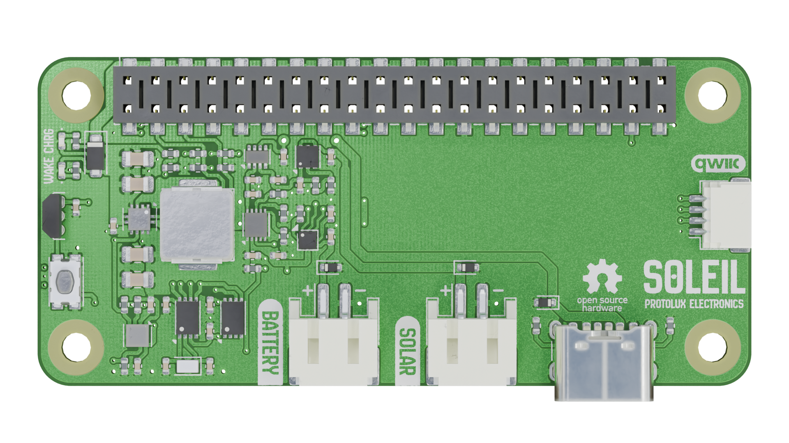
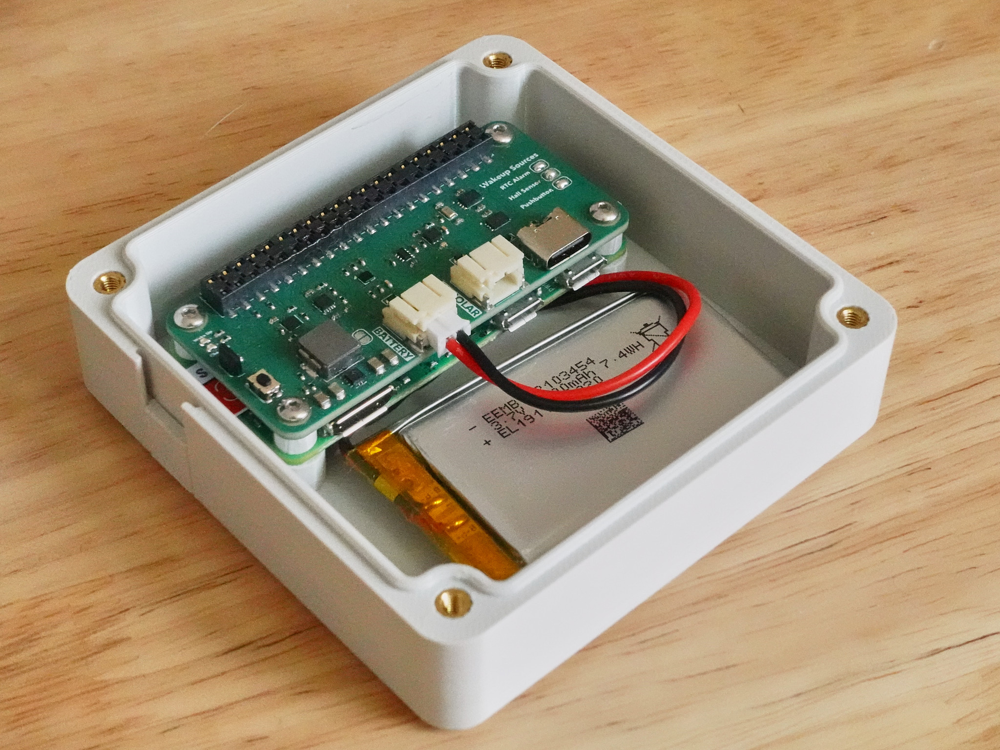
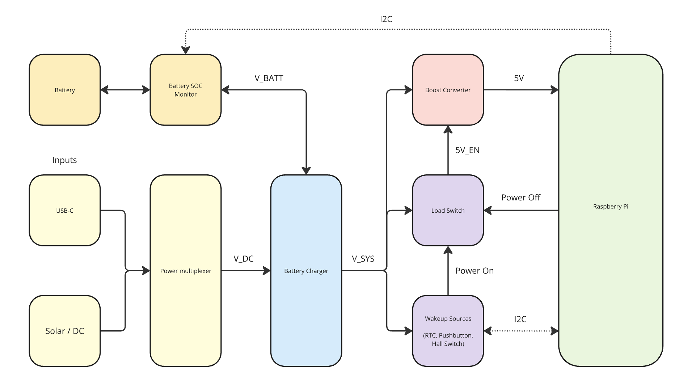

# Soleil Hardware

 
Soleil is a multi-functional solar charger and smart power management board for Rasbperry Pi. It has multiple use cases:

- **Off-grid**: power your project and simultaneously charge a single cell LiPo battery with a solar panel, up to 10W/16V.
- **Uninterruptible power supply**: Use a standard USB-C cable to power your Pi. In the case of a power outage, the power supply will automatically swap over to the backup battery without missing a beat.
- **Low power sleep mode**: completely cut off power to the Raspberry Pi for a duration of time. An onboard real-time clock will wake your project at the exact second you specify, up to one year in the future.

## Alternatives

Soleil takes inspiration from other boards on the market:

- [PiJuice Zero](https://uk.pi-supply.com/collections/pijuice/products/pijuice-zero)
- [WittyPi 4 Mini](https://www.uugear.com/product/witty-pi-4-mini/)
- [LiFePO4wered/Pi+](https://www.crowdsupply.com/silicognition/lifepo4wered-pi-plus)

Soleil is different, as it combines both the smart power management features with solar battery charging, up to 16V. In low power mode, Soleil only draws 15uA, making it a great choice for projects such as weather stations, IoT sensors, wildlife cameras, and more. Additionally, Soleil doesn't have a microcontroller onboard, and thus doesn't require firmware. It makes it just a little bit easier to hack on without requiring specialized programming hardware.

Additionally, Soleil is completely open hardware, build with KiCad. You can hack the hardware, modify the design to add your own sensors, or customize it to your liking. Supporting Soleil means supporting Open Source Hardware - an initiative that benefits all of us.

## Additional Features

Soleil includes a battery fuel gauge IC to get accurate state of charge estimations. There are also two manual wakeup sources - a pushbutton and a hall-effect switch. You may replace the hall effect switch with any open-drain sensor or circuit to trigger wakeup. Finally, Soleil features an ATECC608A security chip to provide first-class support for [NervesHub](https://nerves-hub.org), a firmware update management tool for Nerves-powered devices. 

See the block diagram below for an understanding of the connectivity of each of Soleil's components:

## Software

The official software library is available in the [Soleil repository](https://github.com/protolux-electronics/soleil). Soleil was specifically designed for use with the [Nerves Framework](https://nerves-project.org). See the [documentation](https://hexdocs.pm/soleil) for more information.

## Protolux Electronics

Soleil was designed by Protolux Electronics. We're a tiny team of passionate engineers, creatives, and designers based in Luxembourg.
